# Java学习笔记

# 使用IDEA开发第一个java程序的步骤

1. 创建该工程 new Project(空工程)
2. 创建模块 new Module
3. 创建包 new Package
4. 创建类
5. 编写代码,并启动

# IDEA常用快捷键

- 组合几个键快速完成某件事,可以提高开发效率

| 快捷键                            | 作用                      |
| --------------------------------- | ------------------------- |
| main/psvm,sout,...                | 快速键入相关代码          |
| Ctrl + D                          | 复制当前行数据到下一行    |
| Ctrl + Y                          | 删除所在行,建议用Ctrl + X |
| Ctrl + X                          | 剪切当前行                |
| Ctrl + Alt + L                    | 格式化当前代码            |
| Alt + Shift + ↑ , Alt + Shift + ↓ | 上下移动当前代码          |
| Ctrl + / , Ctrl + Shift + /       | 对代码进行注释            |

# java基础语法

## 注释

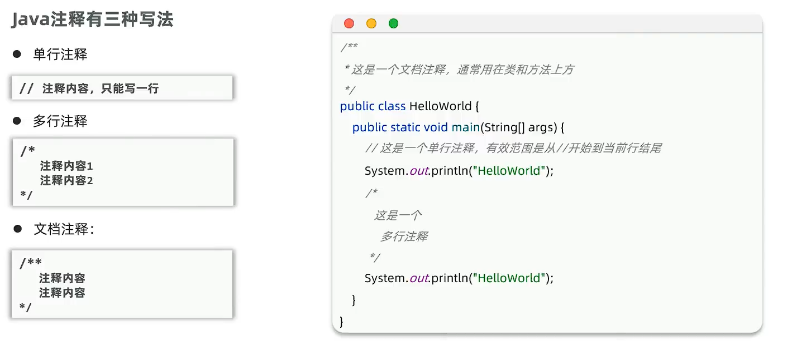

### 注释的特点

- 注释不影响程序的执行

## 字面量

字面量就是程序中能直接书写的数据

### 字面量的分类

| 常用数据       | 生活中的写法 | 程序中的写法              | 说明                                    |
| -------------- | ------------ | ------------------------- | --------------------------------------- |
| 整数           | 666, -88     | 666, -88                  | 写法一致                                |
| 小数           | 13.14, -5.21 | 13.14, -5.21              | 写法一致                                |
| 字符           | A, 0, 我     | 'A', '0', '我'            | 程序中必须使用单引号,有且仅能有一个字符 |
| 字符串         | 你好世界     | "hello world", "你好世界" | 程序中必须使用双引号,内容可有可无       |
| 布尔值         | 真, 假       | true, false               | 只有两个值:true代表真, false代表假      |
| 空值           | -            | NULL                      | 一个特殊的值,空值                       |
| 特殊字符字面量 | -            | \t \n                     | 转义字符                                |

## 变量

变量就是内存中的一块区域,可以理解成一个盒子

- 定义格式: 数据类型 变量名称 = 数据;
- 使用变量记住要处理的数据,编写的代码更灵活,管理代码方便

## 数据类型

### 基本数据类型的分类

基本数据类型:**4大类8种**

| 数据类型     | 内存占用(字节数) | 数据范围 |
| ------------ | ---------------- | -------- |
| 整形         | byte             | 1        | -128~127                                         |
|              | short            | 2        | -32768~32767                                     |
|              | int(默认)        | 4        | -2147483648~2147483647(10位数,大约21亿)          |
|              | long             | 8        | -9223372036854775808~9223372036854775807(19位数) |
| 浮点型(小数) | float            | 4        | 1.401298E-45到3.4028235E+38                      |
|              | double(默认)     | 8        | 4.9000000E-324到1.797693E+308                    |
| 字符型       | char             | 2        | 0~65535                                          |
| 布尔型       | boolean          | 1        | true, false                                      |

## 方法

方法是执行特定任务或操作的代码块,代表一个功能,它可以接受数据进行处理,并返回一个处理后的结果

### 方法的定义格式

修饰符 返回值类型 方法名(形参列表) {
    方法体(需要执行的功能代码)

    return 返回值;
}

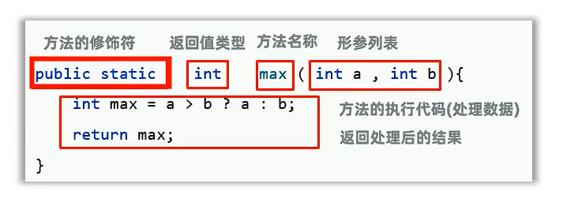

### 方法的注意事项

1. 方法可以重载
    - **一个类中**,出现**多个方法的名称相同**,但是它们的**形参列表是不同的**,那么这些方法就称为**方法重载**.
    - 方法重载只关心方法名称相同,形参列表不同(类型不同,个数不同,顺序不同).

2. 无返回值的方法中可以直接通过单独的return立即结束当前方法的执行

## 类型转换


- **类型范围小**的变量,可以**直接赋值**给**类型范围大**的变量
- **类型范围大**的变量,不可以**直接赋值**给**类型范围小**的变量,会报错,需要强制类型转换

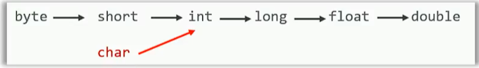

强制类型转换格式: 类型 变量2 = (类型)变量1;

注意:强制类型转换**可能会造成数据(丢失)溢出**;浮点型强转为整形,**会直接丢掉小数部分,保留整数部分返回**

总结:

为什么需要进行类型转换?

- 存在不同类型的变量赋值给其他类型的变量

什么是自动类型转换?

- **类型范围小**的变量,可以**直接赋值**给**类型范围大**的变量

什么是强制类型转换?

- 默认情况下,大范围类型的变量直接赋值给小范围类型的

## 输入输出

- 输出:把程序中的数据展示出来.`System.out.println("Hello World");`
- 输入:程序读取用户键盘输入的数据.`通过java提供的Scanner程序来实现`

Scanner是java提供好的API,程序员可以直接调用

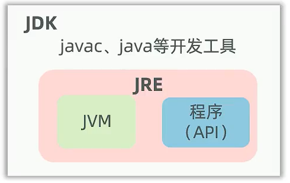

``` java
package com.learning.scanner;
import java.util.Scanner;
public class Test {
    public static void main(String[] args) {
        Scanner sc = new Scanner(System.in);

        System.out.println("请输入您的年龄:");
        int age = sc.nextInt();
        System.out.println("年龄是:" + age);

        System.out.println("请输入您的名称:");
        String name = sc.next();
        System.out.println("欢迎: " + name);
    }
}
```

## 运算符

### 基本的算术运算符

| 符号 | 作用 | 说明                             |
| ---- | ---- | -------------------------------- |
| +    | 加   | -                                |
| -    | 减   | -                                |
| *    | 乘   | -                                |
| /    | 除   | 在java中两个整数相除结果还是整数 |
| %    | 取余 | 获取的是两个数据做除法的余数     |

#### +符号在java中的特殊用途

- "+" 符号在有些情况下可以用作连接符
- "+" 符号与**字符串运算**的时候是用作**连接符**的,其结果依然是一个字符串

### 自增自减运算符

| 符号    | 作用                                       |
| ------- | ------------------------------------------ |
| 自增:++ | 放在某个变量前面或者后面,对变量自身的值加1 |
| 自减:-- | 放在某个变量前面或者后面,对变量自身的值减1 |

注意:

- ++, -- 如果在变量前后单独使用是没有区别的
- ++, -- 如果不是单独使用(如在表达式中,或同时有其他操作),放在变量前后会存在明显区别
  - 在变量的前面,先对变量+1, -1, 再拿变量的值运算
  - 在变量的后面,先拿变量的值运算,再对变量的值+1, -1

### 赋值运算符

#### 基本赋值运算符

- "=" ,赋值顺序从右往左

#### 扩展赋值运算符

| 符号 | 用法   | 作用       | 底层代码形式          |
| ---- | ------ | ---------- | --------------------- |
| +=   | a += b | 加后赋值   | a = (a的类型)(a + b); |
| -=   | a -= b | 减后赋值   | a = (a的类型)(a - b); |
| *=   | a *= b | 乘后赋值   | a + (a的类型)(a * b); |
| /+   | a /= b | 除后赋值   | a = (a的类型)(a / b); |
| %=   | a %= b | 取余后赋值 | a = (a的类型)(a % b); |

注意:扩展的赋值运算符隐含了强制类型转换

### 关系运算符,三元运算符

#### 关系运算符

 | 符号 | 例子                 | 作用                          | 结果                          |
 | ---- | -------------------- | ----------------------------- | ----------------------------- |
 | >    | a > b                | 判断a是否大于b                | 成立返回true, 不成立返回false |
 | >=   | a >= b               | 判断a是否大于或等于b          | 成立返回true, 不成立返回false |
 | <    | a < b                | 判断a是否小于b                | 成立返回true, 不成立返回false |
 | <=   | 判断a是否小于或等于b | 成立返回true, 不成立返回false |
 | ==   | a == b               | 判断a是否等于b                | 成立返回true, 不成立返回false |
 | !=   | a != b               | 判断a是否不等于b              | 成立返回true, 不成立返回false |
 
#### 三元运算符

- 格式: `条件表达式 ? 值1 : 值2;`
- 执行流程:首先计算**关系表达式的值**,如果值为true,返回值1, 如果为false,返回值2

### 逻辑运算符

把多个条件放在一起运算,最终返回布尔类型的值: true, false

| 符号   | 叫法     | 例子             | 运算逻辑                                                             |
| ------ | -------- | ---------------- | -------------------------------------------------------------------- |
| `&`    | 逻辑与   | 2 > 1 & 3 > 2    | 多个条件必须都是true, 结果才是true; 有一个是false, 结果就是false     |
| `\|`   | 逻辑或   | 2 > 1 \| 3 < 5   | 多个条件中只要有一个是true, 结果就是true                             |
| `!`    | 逻辑非   | !(2 > 1)         | 取反, 你真我假, 你假我真                                             |
| `^`    | 逻辑异或 | 2 > 1 ^ 3 > 1    | 前后条件的结果相同, 就直接返回false, 前后条件的结果不同, 才返回false |
| `&&`   | 短路与   | 2 > 10 && 3 > 2  | 判断结果与 "&" 一样, 过程不同, 左边为false, 右边不执行               |
| `\|\|` | 短路或   | 2 > 1 \|\| 3 < 5 | 判断结果与 "\|" 一样, 过程不同, 左边为true, 右边不执行               |

## 程序流程控制

### 分支结构

#### if分支结构

根据条件的真或假,来决定执行某段代码

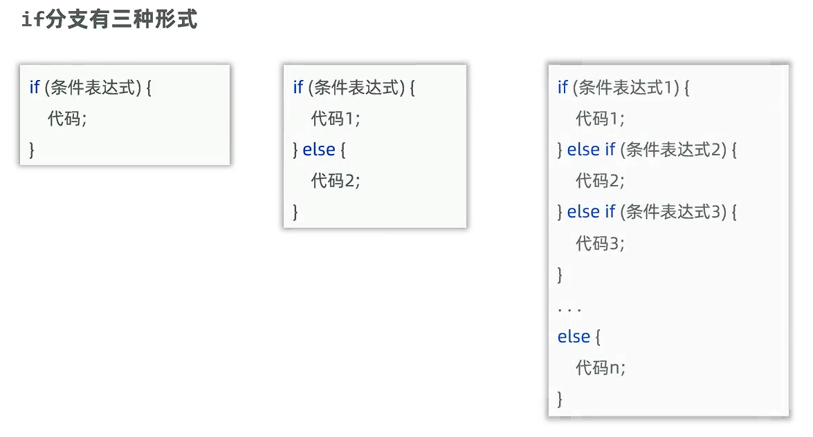

#### switch分支结构

通过比较具体的值是否相等,来决定执行哪条分支

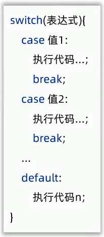

注意:

1. 表达式类型只能是**byte, short, int, char**, JDK5开始支持枚举,JDK7开始支持String, **不支持double, float, long**
2. case给出的值不允许重复, 且只能是字面量, 不能是变量
3. 正常使用switch的时候,不要忘记写break, 否则会出现穿透现象
4. 当存在多个case分支的代码相同时, 可以把相同的代码放到一个case块中, 其它的case块都通过穿透性穿透到该case块执行代码即可, 这样可以简化代码

### 循环结构

#### for循环

控制一段代码反复执行很多次

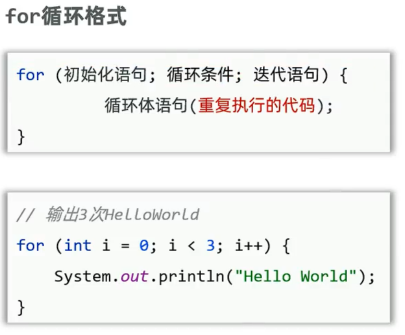

#### while循环

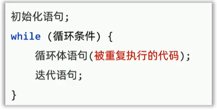

#### do-while循环

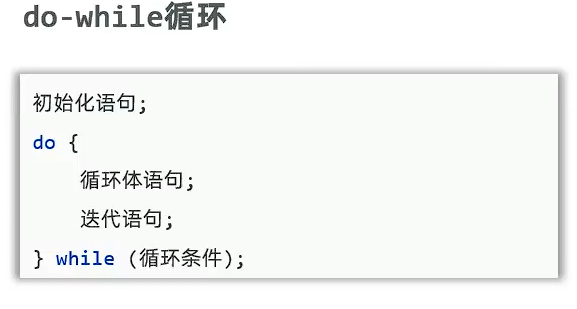

#### 死循环

可以一致执行下去的一种循环,如果没有干预不会停下来

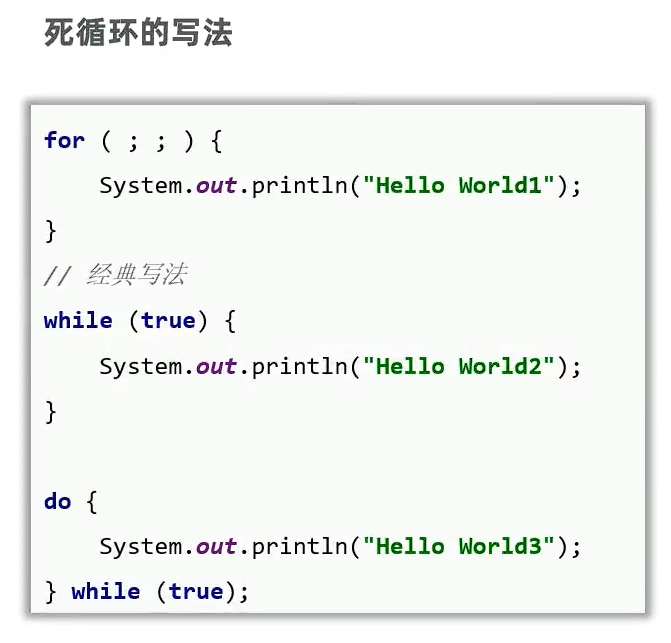

#### 循环嵌套

循环中又包含循环

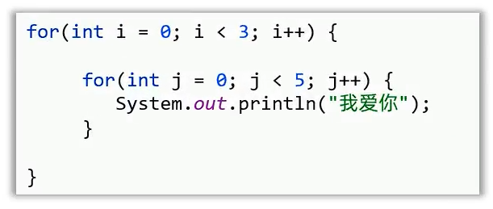

#### break, continue

- break: 跳出并结束当前所在循环的执行
- continue: 用于跳出当前循环的当次执行, 直接进入循环的下一次执行

注意:

- break: 只能用于结束所在循环, 或者结束所在switch分支的执行
- continue: 只能在循环中进行使用

## 数组

数组是一个数据容器,可用来存储一批同类型的数据

### 数组的定义方式

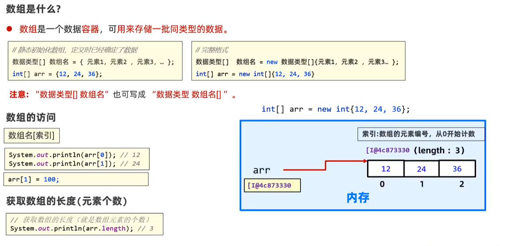

注意:`数据类型[] 数组名`也可以写成`数据类型 数组名[]`

### 动态初始化数组

定义数组时先不存入具体的元素值,只确定数组存储的数据类型和数组的长度

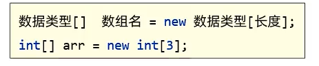

动态初始化数组元素默认值规则:

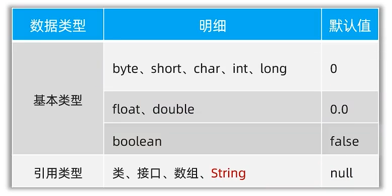

### 二维数组

数组中的每个元素都是一个一维数组, 这个数组就是二维数组

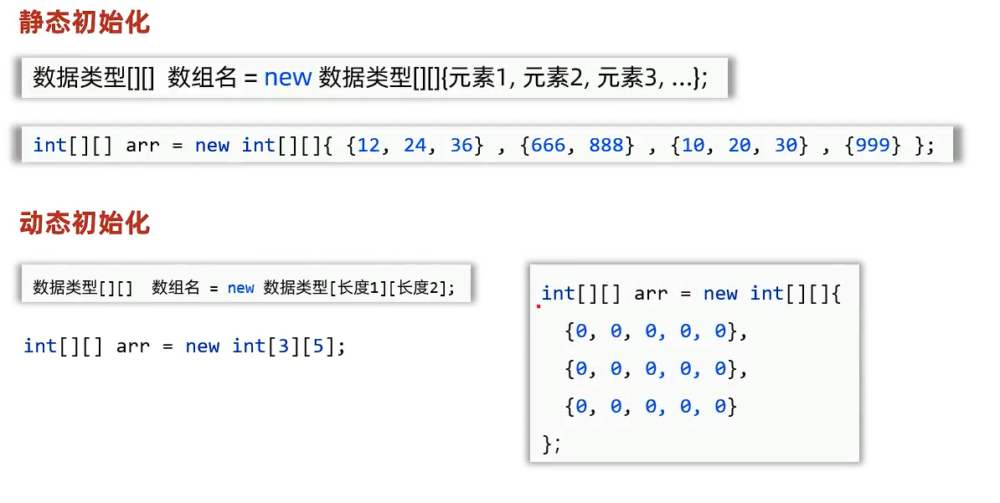

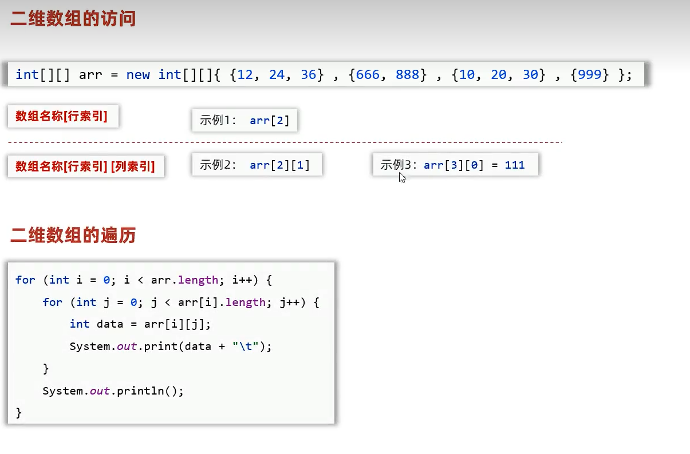

# java面向对象编程

对象是一种特殊的数据结构, 可以用来记住一个事物的数据, 从而代表该事物

1. 先设计对象的模板, 也就是对象的设计图: 类
2. 通过new关键字实例化对象, 每new一次类就得到一个新的对象

## 构造器

构造器是一种特殊方法, 不能写返回值类型, 名称必须和类名相同

``` java
public class Student {
    // 无参构造器
    public Student() {}

    //有参构造器
    public Student(String name, int age) {
        ...
    }
}
```

注意:

- 类默认就自带了一个无参构造器
- 如果为类定义了有参构造,类默认的无参构造器就没有了

## this关键字

- this就是一个变量, 可以用在方法中来拿到当前对象
- this主要用来解决变量名称冲突的问题

## 封装

### 什么是封装

- 就是用类设计对象处理某一个事物的数据时, 应该把要处理的数据, 以及处理这些数据的方法, 涉及到同一个对象中去
- 面向对象三大特征: 封装, 继承, 多态

### 封装的设计规范是什么样的

- 合理隐藏, 合理暴露

### 代码层面如何控制对象的成员公开或隐藏

- 公开成员, 可以使用`public`进行修饰
- 隐藏成员, 使用`private`进行修饰

## 实体类

是一种特殊类, 类中要满足如下需求:

1. 类中的成员变量全部私有, 并提供public修饰的getter/setter方法
2. 类中需要提供一个无参数构造器, 有参数构造器可选

## static

static叫静态, 可以修饰成员变量, 成员方法

成员变量按照有误static修饰, 分为两种:

- 静态变量(类变量): 有static修饰, 属于类, 在计算机里只有一份, 会被类的全部对象共享
- 实例变量(对象的变量): 无static修饰, 属于每个对象的

成员方法的分类:

- 静态方法: 有static修饰的成员方法, 属于类
- 实例方法: 无static修饰的成员方法, 属于对象

工具类不需要创建对象, 建议将工具类的构造器私有化

### 静态方法, 实例方法相关的注意事项

- 静态方法中可以直接访问静态成员, 不可以直接访问实例成员
- 实例方法中既可以直接访问静态成员, 也可以直接访问实例成员
- 实例方法中可以出现this关键字, 静态方法中不可以出现this关键字

## 继承

- java中提供了一个关键字extends, 用这个关键字, 可以让一个类和另一个类建立起父子关系
- 子类能继承父类的非私有成员(成员变量, 成员方法)
- 子类的对象创建是由子类, 父类共同完成的

### 权限修饰符

用来限制类中的成员(成员变量, 成员方法, 构造器)能够被访问的范围

- private 只能本类
- 缺省(default) 本类, 同一个包中的类
- protected 本类, 同一个包中的类, 子孙类
- public 任意位置

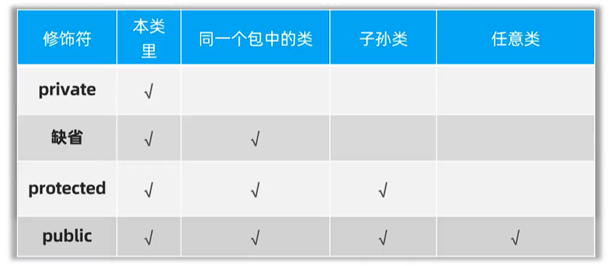

### 继承的特点

- 单继承: java是单继承模式, 一个类只能直接继承一个父类
- 多层继承: java不支持多继承, 但支持多层继承
- 祖宗类: java中所有的类都是Object类的子类
- 就近原则: 优先访问自己类中的成员(成员变量, 成员方法), 自己类中的没有才会访问父类

### 继承后子类访问成员的特点: 就近原则

1. 在子类方法中访问其他成员(成员变量, 成员方法), 是依照就近原则的
    - 先在子类局部范围找, 然后在子类成员范围找, 然后在父类成员范围找, 如果父类范围还没有找到就报错
2. 如果子父类中, 出现了重名的成员, 会优先使用子类的
    - 如果要在子类中访问父类成员可以通过`super`关键字, 指定访问父类的成员

### 方法重写

当子类觉得父类中的某个方法不好用, 或者无法满足自己的需求时, 子类可以重写一个方法名称, 参数列表一样的方法来覆盖父类的方法, 这就是方法重写

``` java
class Cat extends Animal {
    //方法重写: 方法名称, 形参列表必须一样
    @Override //方法重写的校验注解(标志): 要求方法名称和形参列表必须与被重写的方法一致, 否则报错
    public void cry() {
        System.out.println("喵喵喵");
    }
}

class Animal {
    public void cry() {
        System.out.println("咕咕嘎嘎");
    }
}
```

注意:

- 使用`Override`注解可以指定java编译器检查方法重写是否正确
- 子类重写父类方法时, 访问权限必须大于或者等于父类方法的权限(public>protected>默认)
- 重写的方法返回值类型, 必须与被重写方法的返回值类型一致, 或者范围更小
- 私有方法, 静态方法不能被重写

#### 方法重写的常见场景

- 子类重写`Object`类的`toString()`方法, 以便返回对象的内容

### 子类构造器

- 子类的全部构造器, 都会先调用父类的构造器, 再执行自己
- 默认情况下, 子类全部构造器的第一行代码都是`super()`(写不写都有), 它会调用父类的无参数构造器

### this(...)调用兄弟构造器

任意类的构造器中, 可以通过this(...)来调用该类的其他构造器

注意: super(...) this(...) 必须写在构造器的第一行, 且两者不能同时出现

## 多态

多态是在继承/实现情况下的一种现象, 表现为: 对象多态, 行为多态

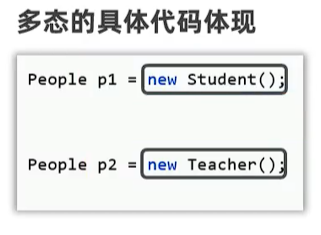

### 多态的前提

有继承/实现关系; 存在父类引用子类对象; 存在方法重写

注意: 多态是对象, 行为的多态, java中的属性(成员变量)不具备多态

### 多态的好处

- 在多态形式下, 右值对象是解耦合的, 更便于扩展和维护

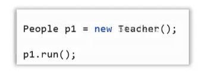

- 定义方法时, 使用父类类型的形参, 可以接受一切子类对象, 扩展性更强, 更便利

注意: 多态下不能使用子类的独有功能

### 多态下的类型转换问题

- 自动类型转换: 父类 变量名 = new 子类();
- 强制类型转换: 子类 变量名 = (子类) 父类变量;

注意:

- 存在继承/实现关系就可以在编译阶段进行强制类型转换, 编译阶段不会报错
- 运行时, 如果发现对象的真实类型与强转后的类型不同, 就会报类型转换异常(ClassCastException)的错误

强转前, java建议: 使用`instanceof`关键字, 判断当前对象的真实类型, 再进行强转

`p instanceof Student`

## final关键字

final关键字是最终的意思, 可以修饰: 类, 方法, 变量

- 修饰类: 该类被称为最终类, 特点是不能被继承了
- 修饰方法: 该方法被称为最终方法, 特点是不能被重写了
- 修饰变量: 该变量仅能被赋值一次

注意:

- final修饰基本类型的变量, 变量存储的数据不能被改变
- final修饰引用类型的变量, 变量存储的地址不能被改变, 但地址所指向对象的内容是可以被改变的

## 常量

- 使用了`static final`修饰的成员变量就被成为常量
- 作用: 常用于记录系统的配置信息

注意: 
- 常量名的命名建议使用大写英文单词, 多个单词使用下划线连接起来
- 程序编译后, 常量会被"宏替换": 出现常量的地方全部会被替换成字面量

## 枚举类

枚举是一种特殊类

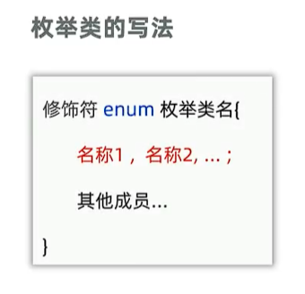

特点:

- 枚举类中的第一行, 只能写枚举类的对象名称, 且要用逗号隔开
- 这些名称, 本质是常量, 每个常量都记住了枚举类的一个对象
- 枚举都是最终类, 不可以被继承, 枚举类都是继承java.lang.Enum类的
- 枚举类的构造器都是私有的, 因此, 枚举类对外不能创建对象

### 枚举类的常见应用场景

枚举类很适合做信息分类标志

## 抽象类

在java中有一个关键字叫: `abstract`, 意思是抽象, 可以用它来修饰类, 成员方法

- `abstract`修饰类, 这个类就是抽象类
- `abstract`修饰方法, 这个方法就是抽象方法

``` java
public abstract class A {
    //抽象方法: 必须abstract修饰, 只有方法签名, 不能有方法体
    public abstract void test();
}
```

注意:

- 抽象类中不一定要有抽象方法, 有抽象方法的类必须是抽象类
- 类有的成员: 成员变量, 方法, 构造器, 抽象类都可以有
- 抽象类不能创建对象, 仅作为一种特殊的父类, 让子类继承并实现
- 一个类继承抽象类, 必须重写完抽象类的全部抽象方法, 否则这个类也必须定义成抽象类

### 使用抽象类的好处

- 父类知道每个子类都要做某个行为, 但每个子类要做的情况不一样, 父类就定义成抽象方法, 交给子类去重写实现, 设计这样的抽象类, 就是为了更好地支持多态

## 接口

java提供了`interface`关键字用于定义接口

``` java
public interface 接口名 {
    // 成员变量(常量)
    // 成员方法(抽象方法)
}
```

注意: 

- 接口不能创建对象
- 接口是用来被类实现(implements)的, 实现接口的类成为实现类, 一个类可以同时实现多个接口
- 接口与接口可以多继承: 一个接口可以同时继承多个接口
- 一个接口继承多个接口, 如果多个接口中存在方法签名冲突, 则此时不支持多继承, 也不支持多实现
- 一个类继承了父类, 又同时实现了接口, 如果父类中和接口中有同名的方法, 实现类会优先用父类的
- 一个类实现了多个接口, 如果多个接口中存在同名的默认方法, 可以不冲突, 这个类重写该方法即可

``` java
修饰符 class 实现类类名 implements 接口1, 接口2, 接口3, ... {
    // 实现类实现多个接口, 必须重写完接口的全部抽象方法, 否则实现类需要定义为抽象类
}
```

### 接口的好处

- 弥补了类单继承的不足, 一个类同时可以实现多个接口, 使类的角色更多, 功能更强大
- 让程序可以面向接口编程, 这样程序员就可以灵活方便的切换各种业务实现(更利于程序的解耦合)

### 接口新增的三种方法

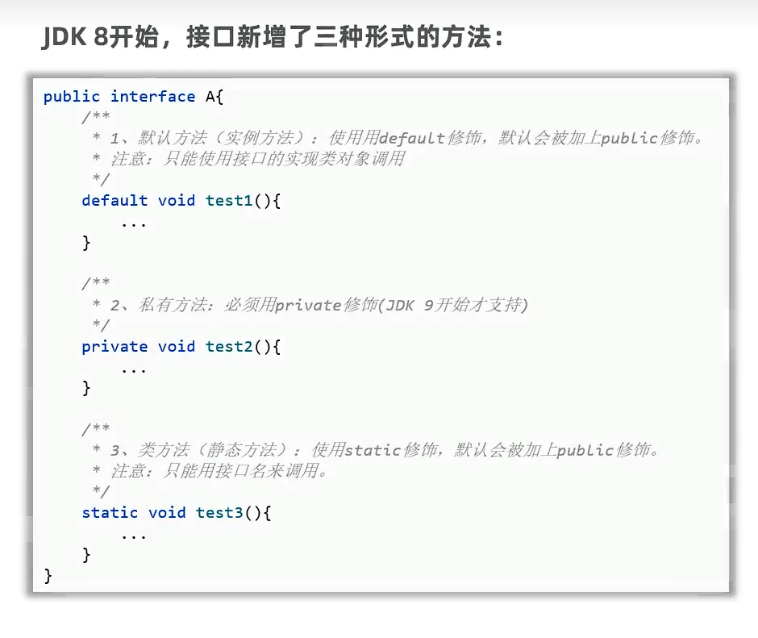

### 抽象类, 接口的区别

相同点:

1. 都是抽象形式, 都可以有抽象方法, 都不能创建对象
2. 都是派生子类形式: 抽象类是被子类继承使用, 接口是被实现类实现
3. 一个类继承抽象类, 或者实现接口, 都必须重写完他们的抽象方法, 否则自己要成为抽象类或者报错
4. 都支持多态, 都能够实现解耦合

不同点:

1. 抽象类中可以定义类的全部普通成员, 接口只能定义常量, 抽象方法(JDK8新增的三种形式)
2. 抽象类只能被类单继承, 接口可以被类多实现
3. 一个类继承抽象类就不能再继承其他类, 一个类实现了接口(还可以继承其他类或者实现其它接口)
4. 抽象类体现模板思想, 跟利于做父类实现代码的复用性
5. 接口更适合做功能的解耦合, 解耦合性更强更灵活

# java高级编程

## 代码块

代码块是类的5大成分之一(成员变量, 构造器, 方法, 代码块, 内部类)

代码块分为两种:

- 静态代码块:
    - 格式: `static{}`
    - 特点: 类加载时自动执行, 由于类只会加载一次, 所以静态代码块也只会执行一次
    - 作用: 完成类的初始化, 例如: 对静态变量的初始化赋值

- 实例代码块:
    - 格式: `{}`
    - 特点: 每次创建对象时, 执行实例代码块, 并在构造器前执行
    - 作用: 和构造器一样, 都是用来完成对象的初始化的, 例如: 对实例变量进行初始化

## 内部类

- 如果一个类定义在另一个类的内部, 这个类就是内部类
- 场景: 当一个类的内部, 包含了一个完整的事物, 且这个事物没有必要单独设计时, 就可以把这个事物设计成内部类

``` java
public class Car {
    // 内部类
    public class Engine {

    }
}
```

### 成员内部类

就是类中的一个普通成员, 类似前面我们学过的普通的成员变量, 成员方法

``` java
public class Outer {
    // 成员内部类
    public class Inner {

    }
}
```

创建对象的格式:

``` java
外部类名.内部类名 对象名 = new 外部类(...).new 内部类(...);
Outer.Inner in = new Outer().new Inner();
```

成员内部类中访问其他成员的特点:

1. 成员内部类中可以直接访问外部类的静态成员, 也可以直接访问外部类的实例成员
2. 成员内部类的实例方法中, 可以直接拿到当前寄生的外部类对象: 外部类名.this

## 静态内部类

有static修饰的内部类, 属于外部类自己持有

``` java
public class Outer {
    // 静态内部类
    public static class Inner {

    }
}
```

``` java
外部类名.内部类名 对象名 = new 外部类.内部类(...);

Outer.Inner in = new Outer.Inner();
```

## 局部内部类

局部内部类定义在方法, 代码块, 构造器等执行体中

``` java
public class Test {
    public static void main(String[] args) {

    }

    public static void go() {
        class A {

        }

        abstract class B {

        }

        interface C {

        }
    }
}
```

## 匿名内部类

- 匿名内部类是一种特殊的局部内部类
- 所谓匿名指的是程序员不需要为这个类命名, 默认有个隐藏名字

``` java
new 类或接口(参数值...) {
    类体(一般是方法重写);
};
```

特点: 匿名内部类本质就是一个子类, 并会立即创建出一个子类对象

作用: 用于更方便地创建一个子类对象

### 匿名内部类在开发中的常见形式

通常作为一个对象参数传输给方法

例如, 学生和老师参加游泳比赛:

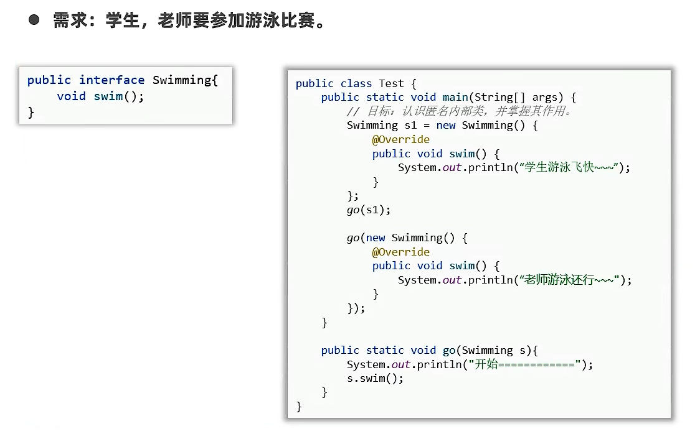

## java函数式编程

### Lambda表达式

使用Lambda函数替代某些匿名内部类对象, 从而让程序代码更简洁, 可读性更好

- JDK8开始新增的一种语法形式, 它表示函数
- 可以用于替代某些匿名内部类对象, 从而让程序更简洁, 可读性更好


``` java
(被重写方法的形参列表) -> {
    被重写方法的方法体代码
}
```

注意: Lambda表达式只能替代函数式接口的匿名内部类

- 函数式接口是指有且仅有一个抽象方法的接口
- 未来遇到的大部分函数式接口, 上面都可能会有一个@FunctionalInterface的注解, 该注解用于约束当前接口必须是函数式接口

#### Lambda表达式省略规则

作用: 用于进一步简化Lambda表达式的写法

具体规则:

- 参数类型全部可以省略不写
- 如果只有一个参数, 参数类型省略的同时"()"也可以省略, 但多个参数不能省略"()"
- 如果Lambda表达式中只有一行代码, 大括号可以不写, 同时要省略分号";", 如果这行代码是return语句, 也必须去掉return

### 方法引用

#### 静态方法引用

语法: `类名::静态方法`

使用场景:

- 如果某个Lambda表达式里只是调用一个静态方法, 并且"->"前后参数的形式一致, 就可以使用静态方法引用

#### 实例方法引用

语法: `对象名::实例方法`

使用场景:

- 如果某个Lambda表达式里只是通过对象名称调用一个实例方法, 并且"->"前后参数的形式一致, 就可以使用实例方法引用

#### 特定类型方法引用

语法: `特定类的名称::方法`

使用场景:

- 如果某个Lambda表达式里只是调用一个特定类型的实例方法, 并且前面参数列表中的第一个参数是作为方法的主调, 后面的所有参数都是作为该实例方法的入参的, 此时就可以使用特定类型的方法引用

#### 构造器引用

语法: `类名::new`

使用场景:

- 如果某个Lambda表达式里只是在创建对象, 并且"->"前后参数情况一致, 就可以使用构造器引用

# java常用API

## String

String代表字符串, 它的对象可以封装字符串数据, 并提供了很多方法完成对字符串的处理

### String创建字符串对象的方式

1. java程序中的所有字符串文字(例如"abc")都为此类的对象

``` java
String name = "李华";
String schoolName = "剑桥大学"
```

2. 调用String类的构造器初始化字符串对象

| 构造器                         | 说明                                   |
| ------------------------------ | -------------------------------------- |
| public String()                | 创建一个空白字符串对象, 不包含任何内容 |
| public String(String original) | 根据传入的字符串内容来创建字符串对象   |
| public String(char[] chars)    | 根据字符数组的内容来创建字符串对象     |
| public String(byte[] bytes)    | 根据字节数组的内容来创建字符串对象     |

## String提供的常用方法

| 方法名                                                               | 说明                                                            |
| -------------------------------------------------------------------- | --------------------------------------------------------------- |
| public int length()                                                  | 获取字符串的长度返回(就是字符个数)                              |
| public char charAt(int index)                                        | 获取某个索引位置处的字符返回                                    |
| public char[] toCharArray():                                         | 将当前字符串转换成字符数组返回                                  |
| public boolean equals(Object anObject)                               | 判断当前字符串与另一个字符串的内容是否一致, 一致返回true        |
| public boolean equalsIgnoreCase(String anotherString)                | 判断当前字符串与另一个字符串的内容是否一样(忽略大小写)          |
| public String substring(int beginIndex, int endIndex)                | 根据开始和结束索引进行截取, 得到新的字符串(包前不包后)          |
| public String substring(int beginIndex)                              | 从传入的索引处截取, 截取到末尾, 得到新的字符串返回              |
| public String replace(CharSequence target, CharSequence replacement) | 使用新值, 将字符串中的旧值替换, 得到新的字符串                  |
| public boolean contains(CharSequence s)                              | 判断字符串中是否包含了某个字符串                                |
| public boolean startsWith(String prefix)                             | 判断字符串是否以某个字符串内容开头, 开头返回true, 否则返回false |
| public String[] split(String regex)                                  | 把字符串按照某个字符串内容分割, 并返回字符串数组                |

## ArrayList集合

| 构造器             | 说明                 |
| ------------------ | -------------------- |
| public ArrayList() | 创建一个空的集合对象 |

| 常用方法名                            | 说明                                   |
| ------------------------------------- | -------------------------------------- |
| public boolean add(E e)               | 将指定的元素添加到此集合的末尾         |
| public void add(int index, E element) | 在此集合中的指定位置插入指定的元素     |
| public E get(int index)               | 返回指定索引处的元素                   |
| public int size()                     | 返回集合中的元素个数                   |
| public E remove(int index)            | 删除指定索引处的元素, 返回被删除的元素 |
| public boolean remove(Object o)       | 删除指定的元素, 返回删除是否成功       |
| public E set(int index, E element)    | 修改指定索引处的元素, 返回被修改的元素 |

# javaGUI编程

- GUI, 全程Graphical User Interface, 是指图形用户界面
- 通过图形元素(如窗口, 按钮, 文本框等)与用户进行交互
- 与命令行界面(CLI)相比, GUI更加只管, 友好

## java的GUI编程包

- AWT(Abstract Window Toolkit)
    - 提供了一组原生的GUI组件, 依赖于操作系统的本地窗口系统
- Swing
    - 基于AWT, 提供了更丰富的GUI组件, 轻量级组件, 不依赖于本地窗口系统

### 常用的Swing组件

- JFrame: 窗口
- JPanel: 用于组织其他组件的容器
- JButton: 按钮组件
- JTextField: 输入框
- JTable: 表格
- ...

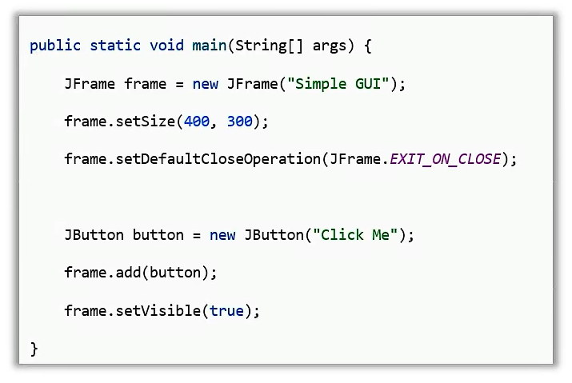

### 常见的布局管理器

- 布局管理器(Layout Manager)它们可以决定组件在容器中的布局方式, 避免了手动设置每个组件的位置和大小, 从而简化GUI设计过程

常见布局管理器:

- FlowLayout
- BorderLayout
- GridLayout
- BoxLayout

#### FlowLayout

简介: FlowLayout是最简单的布局管理器, 它按照水平方向从左到右排列组件, 当一行排满时, 自动换到下一行

特点: 

- 默认居中对齐可以设置为左对齐或者右对齐
- 适用于需要简单排列的场景

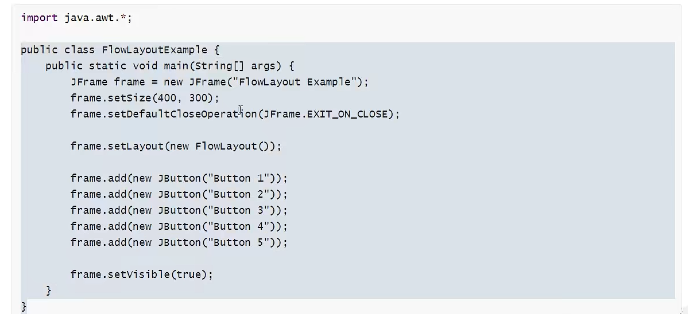

#### BorderLayout

简介: BorderLayout将容器划分为五个区域: 东, 南, 西, 北, 中(East, South, West, North, Center)每个区域只能添加一个组件, 未添加组件的区域保持空白

特点:

- 适用于需要在特定区域布局组件的场景
- 中间区域会占据所有剩余的空间

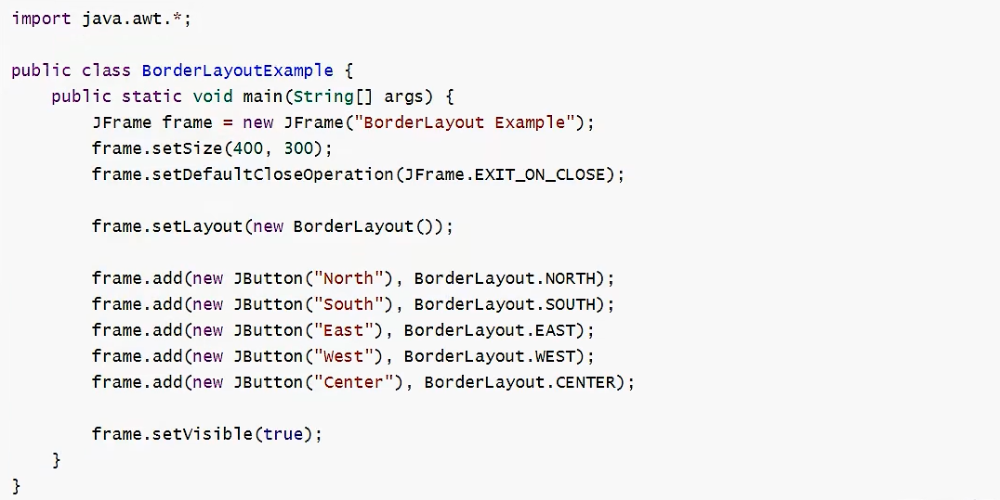

#### GridLayout

简介: GridLayout将容器划分为等大小的网络, 每个网络中可以添加一个组件, 所有组件大小相同

特点: 

- 适用于需要均匀排列组件的场景
- 行和列的数量可以指定

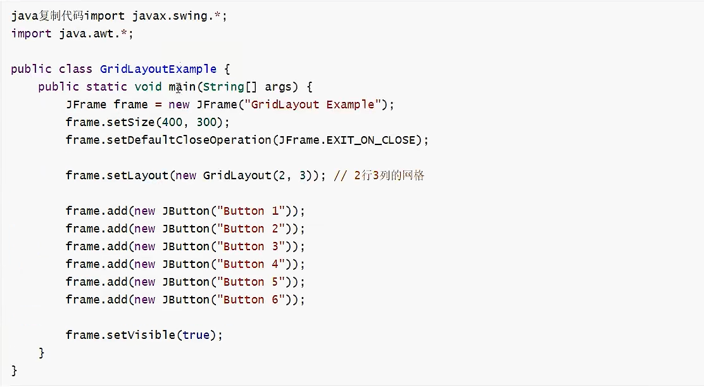

#### BoxLayout

简介: BoxLayout能够沿着单一轴线(X轴或Y轴)排列组件. 可以创建水平(X轴)或垂直(Y轴)排列的布局

特点: 

- 适用于需要沿单一方向排列组件的场景
- 可以通过添加垂直或水平间隙(Glue, Strut)来调整组件间隙

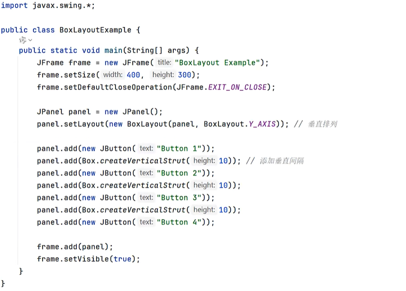

## 事件处理

GUI编程中, 事件的处理是通过事件监听器(Event Listener)来完成的

常用的事件监听器对象

- 点击事件监听器 ActionListener
- 按键事件监听器 KeyListener
- 鼠标行为监听器 MouseListener
- ...

### 事件的几种常见写法

1. 直接提供实现类, 用于创建事件监听对象
2. 直接使用匿名内部类的对象, 代表事件监听对象
3. 自定义窗口, 让窗口对象实现事件接口

# 异常

## java异常体系

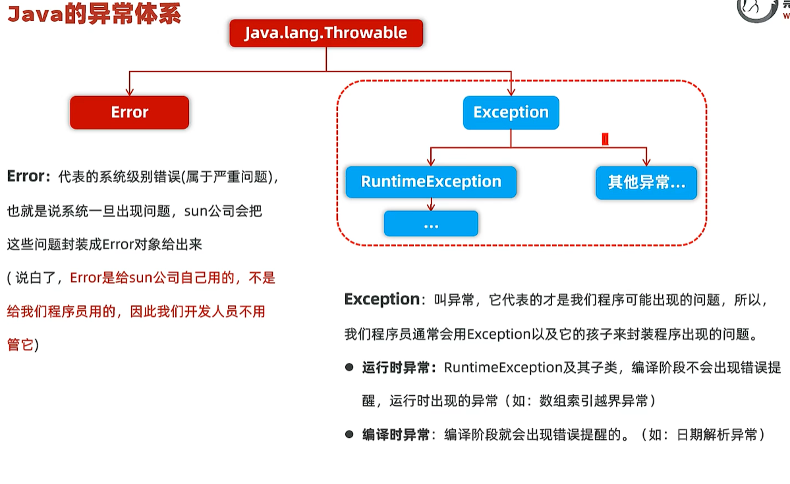

## 异常的基本处理

抛出异常(throws)

- 在方法上使用throws关键字, 可以将方法内部出现的异常抛出去给调用者处理

``` java
方法 shrows 异常1, 异常2, 异常3, ... {
    ...
    throw ...
}
```

捕获异常(try...catch)

- 直接捕获程序出现的异常

``` java
try {
    // 监视可能出现的异常
}catch(异常类型1 变量) {
    // 处理异常
}catch(异常类型2 变量) {
    // 处理异常
}...
```

## 异常的作用

1. 可以用来定位程序bug的关键信息
2. 可以作为方法内部的一种特殊返回值, 以便通知上层调用者, 方法的执行问题

## 自定义异常

java无法为这个世界上全部的问题都提供异常类来代表; 如果企业自己的某种问题, 想通过异常来表示, 就需要自定义异常类

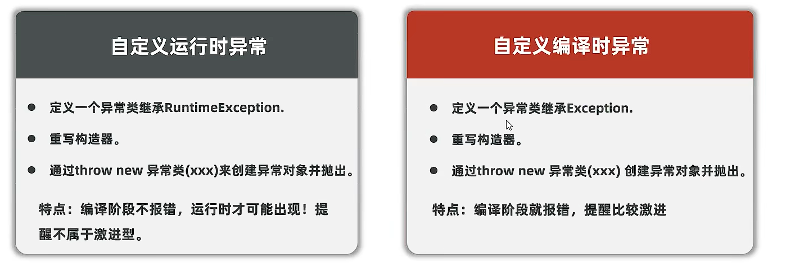

## 异常处理方案

1. 底层异常异常层层往上抛出, 最外层捕获异常, 记录下异常信息, 并响应适合用户观看的信息进行提示
2. 最外层捕获异常后, 尝试重新修复

# 泛型

- 定义类, 接口, 方法时, 同时声明了一个或者多个类型变量(如:\<E\>)成为泛型类, 泛型接口, 泛型方法, 它们统称为泛型

``` java
 public class ArrayList<E> {
    ...
}
```

- 作用: 泛型提供了在编译阶段约束所能操作的数据类型, 并自动检查的能力,这样可以避免强制类型转换, 以及可能出现的异常
- 泛型的本质: 把具体的数据类型作为参数传给类型变量

## 泛型类

``` java
修饰符 class 类名<类型变量, 类型变量, ...> {
    ...
}
```

- 注意: 类型变量建议用大写的英文字母, 常用的有: E, T, K, V等

## 泛型接口

``` java
修饰符 interface 接口名<类型变量, 类型变量, ...> {
    ...
}
```

- 注意: 类型变量建议用大写的英文字母, 常用的有: E, T, K, V等

## 泛型方法, 通配符, 上下限

### 泛型方法

``` java
修饰符<类型变量, 类型变量, ...> 返回值类型 方法名(形参列表) {
    ...
}
```

### 通配符

- 就是"?", 可以在"使用泛型"的时候代表一切类型; E T K V是在定义泛型的时候使用

### 泛型的上下限

- 泛型上限: `?extends Car`: 通配符能接受的必须是Car或者其子类
- 泛型下限: `?super Car`: 通配符能接收的必须是Car或者其父类

## 泛型支持的类型

- 泛型不支持基本数据类型, 只能支持对象类型(引用数据类型)

### 包装类

- 包装类就是把基本的数据类型包装成对象的类型

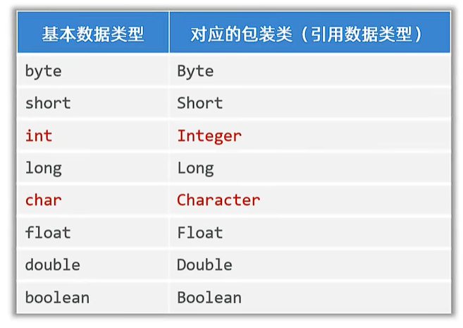

- 自动装箱: 基本数据类型可以自动转换为包装类型
- 自动拆箱: 包装类型可以自动转换为基本数据类型

### 包装类具备的其他功能

- 可以把基本类型的数据转换成字符串类型

``` java
public static String toString(double d)
public String toString()
```

- 可以把字符串类型的数值转换成数值本身对应的真实数据类型

``` java
public static int parseInt(String s)
public static Integer valueOf(String s)
```

# 集合

集合是一种容器, 用来装数据的, 类似于数组, 但集合的大小可变, 开发中也非常常用

## 集合体系结构

- Collection代表单列集合, 每个元素(数据)只包含一个值
- Map代表双列集合, 每个元素包含两个值(键值对)

## Collection集合特点

- List系列集合: 添加的元素是有序, 可重复, 有索引
    - ArrayList, LinkedList: 有序, 可重复, 有索引
- Set系列集合: 添加的元素是无序, 不重复, 无索引
    - HashSet: 无序, 不重复, 无索引
    - LinkedHashSet: 有序, 不重复, 无索引
    - TreeSet: 按照大小默认升序排序, 不重复, 无索引

### Collection的常用功能

- Collection是单列集合的祖宗, 它规定的方法(功能)是全部单列集合都会继承的

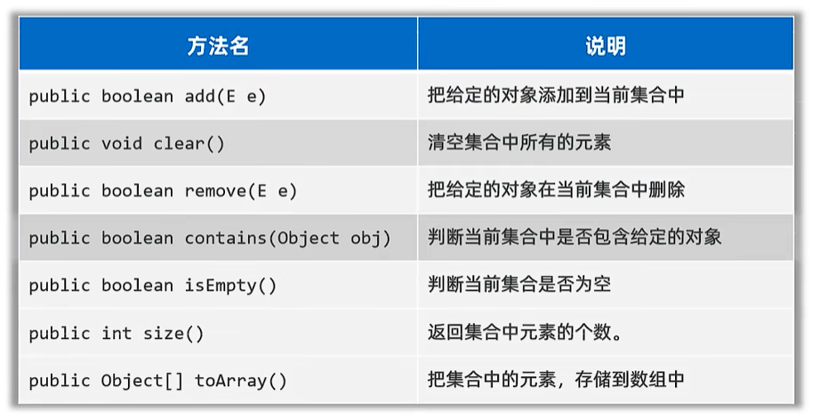

### Collection的遍历方式

#### 迭代器遍历

- 迭代器是用来遍历集合的专用方式(数组没有迭代器), 在java中迭代器的代表是`Iterator`

Collection集合获取迭代器的方法

| 方法名称                 | 说明                                                             |
| ------------------------ | ---------------------------------------------------------------- |
| `Iterator<E> Iterator()` | 返回集合中的迭代器对象, 该迭代器对象默认指向当前集合的第一个元素 |

Iterator迭代器中的常用方法

| 方法名称            | 说明                                                      |
| ------------------- | --------------------------------------------------------- |
| `boolean hasNext()` | 询问当前位置是否有元素存在, 存在返回true, 不存在返回false |
| `E next()`          | 获取当前位置的元素, 并同时将迭代器对象指向下一个元素处    |

#### 增强for循环遍历

格式:

``` java
for (元素的数据类型 变量名 : 数组或者集合) {
    ...
}
```

- 增强for可以用来遍历集合或者数组
- 增强for遍历集合, 本质就是迭代器遍历集合的简化写法

#### Lambda表达式遍历

- 得益于JDK8开始的新技术Lambda表达式, 提供了一种更简单, 更直接的方式来遍历集合

需要使用Collection的如下方法来完成:

| 方法名称                                         | 说明               |
| ------------------------------------------------ | ------------------ |
| default void forEach(Consumer<? super T> action) | 结合lambda遍历集合 |

### List集合体系

List系列集合特点: 有序, 可重复, 有索引

- ArrayList: 有序, 可重复, 有索引
- LinkedList: 有序, 可重复, 有索引

List集合特有的方法:

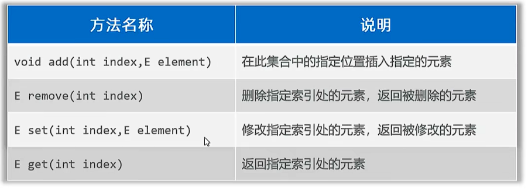

#### ArrayList和LinkedList的区别

- ArrayList底层是基于顺序表存储数据的
- LinkedList底层是基于双链表存储数据的

数组的特点:

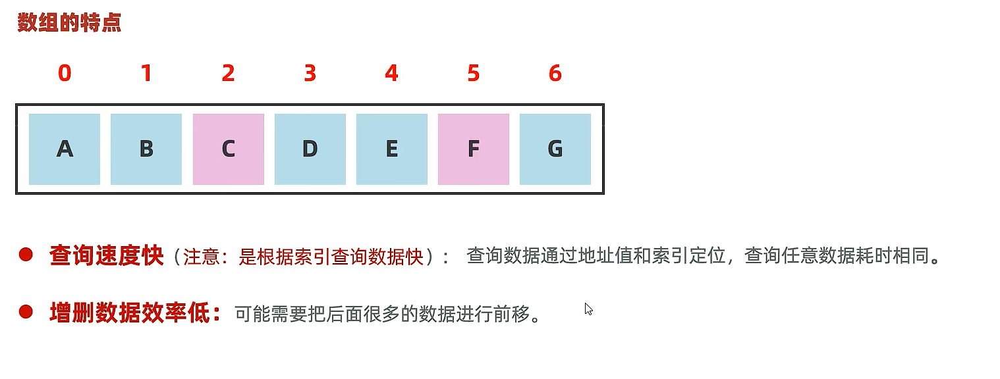

链表的特点:

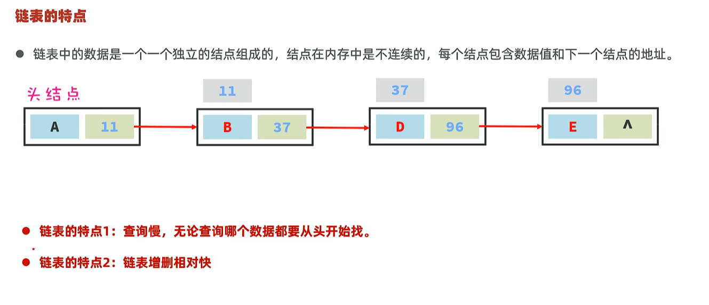

LinkedList的特有方法:

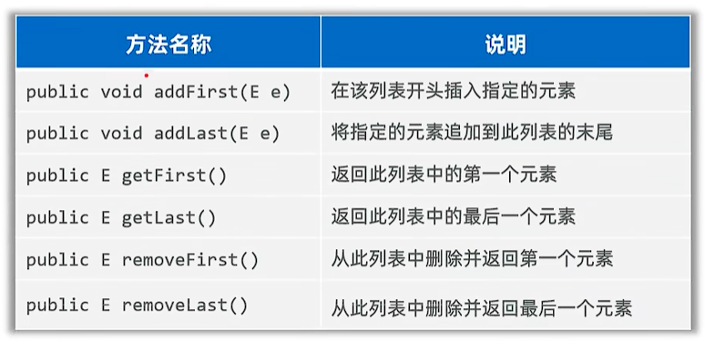

### set集合体系

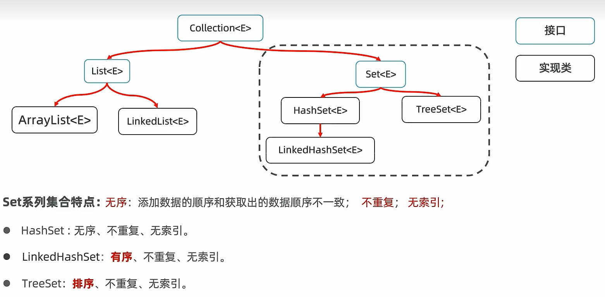

注意: Set要用到的常用方法, 基本上就是Collection提供的, 自己几乎没有额外新增的常用功能 

#### HashSet集合

HashSet是基于哈希表存储数据的

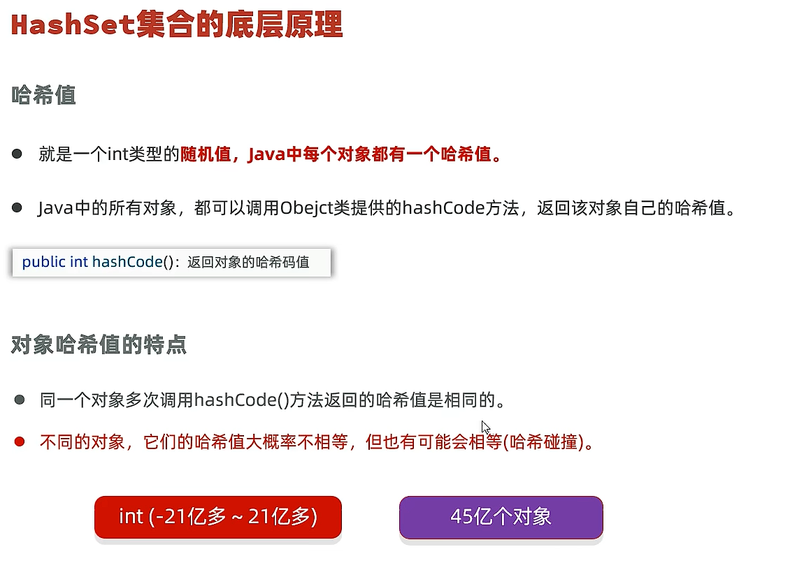

哈希表:

- JDK8之前, 哈希表 = 数组 + 链表
- JDK8开始, 哈希表 = 数组 + 链表 + 红黑树
- 哈希表是一种增删改查数据, 性能都较好的数组结构

#### LinkedHashSet集合

LinkedHashSet的底层原理

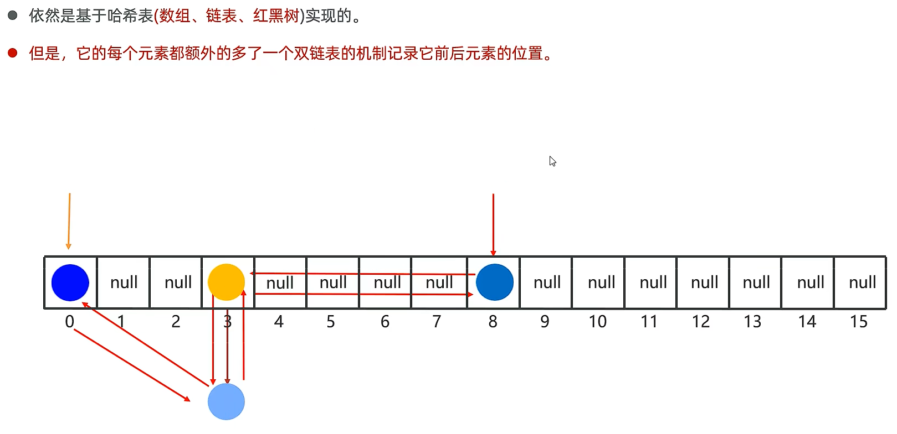

#### TreeSet集合

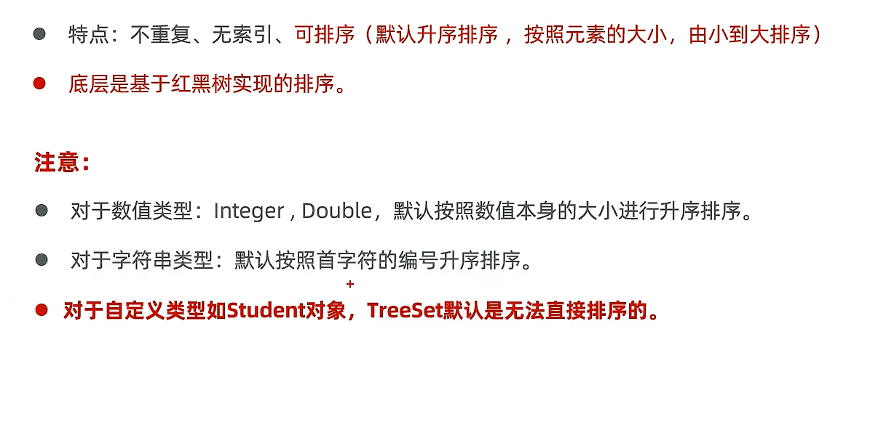

#### 自定义排序规则

- TreeSet集合存储自定义类型的对象时, 必须指定排序规则, 支持如下两种方式来指定比较规则

1. 让自定义的类(如学生类)实现`Comparable`接口, 重写里面的`compareTo`方法来指定比较规则
2. 通过调用TreeSet集合有参数构造器, 可以设置Comparator对象(比较器对象, 用于指定比较规则)
`public TreeSet(Comparator<? super E> cpmparator)`

### 总结

1. 如果希望记住元素的添加顺序, 需要存储重复的元素, 又要频繁的根据索引查询数据
   - 用ArrayList集合(有序, 可重复, 有索引), 底层基于数组.(常用)
2. 如果希望记住元素的添加顺序, 且增删首尾数据的情况较多
   - 用LinkedList集合(有序, 可重复, 有索引), 底层基于双链表. 
3. 如果不在意元素顺序, 也没有重复元素需要存储, 只希望增删改查都快
   - 用HashSet集合(无序, 不重复, 无索引), 底层基于哈希表实现.(常用) 
4. 如果希望记住元素的添加顺序, 也没有重复元素需要存储, 且希望增删改查都快
   - 用LinkedHashSet集合(有序, 不重复, 无索引), 底层基于哈希表和双链表.
5. 如果要对元素进行排序, 也没有重复元素需要存储, 且希望增删改查都快
   - 用TreeSet集合, 基于红黑树实现

## Map集合

- Map集合也被叫做"键值对集合", 格式: {Key1 = value1, key2 = value2, ...}
- Map集合的所有键是不允许重复的, 但值可以重复, 键和值是一一对应的, 每一个键只能找到自己对应的值

### Map集合的体系

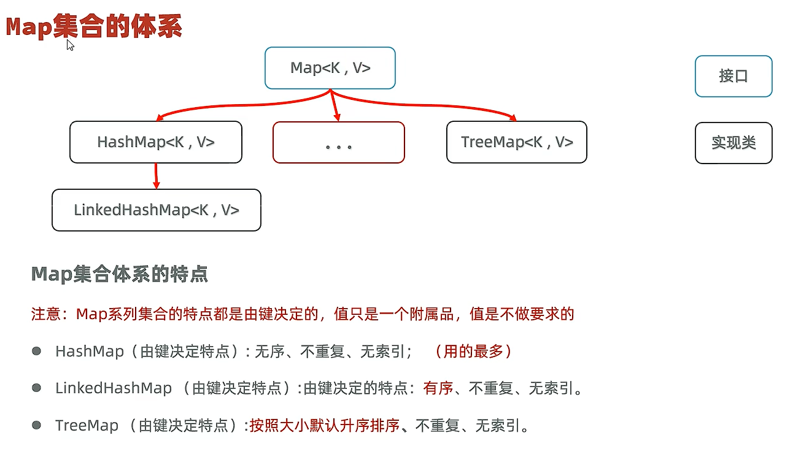

### Map集合的常用方法

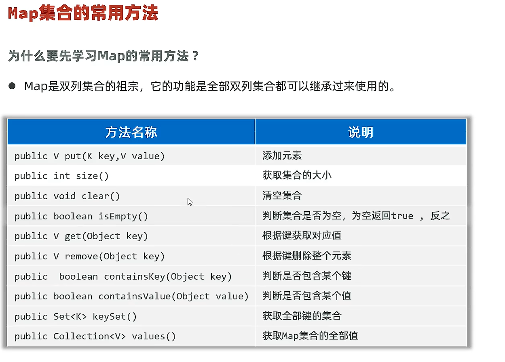

### Map集合的遍历方式

1. 键找值

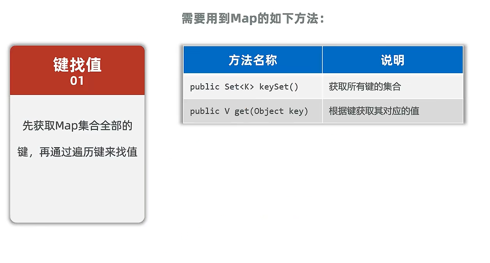

2. 键值对

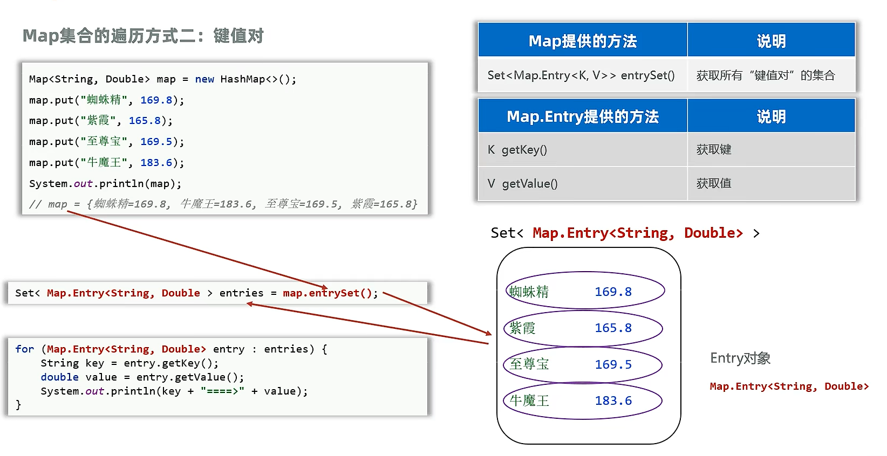

3. Lambda表达式

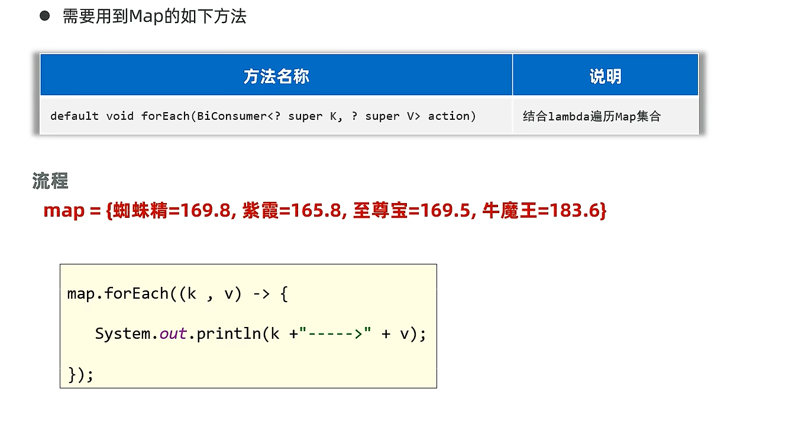
